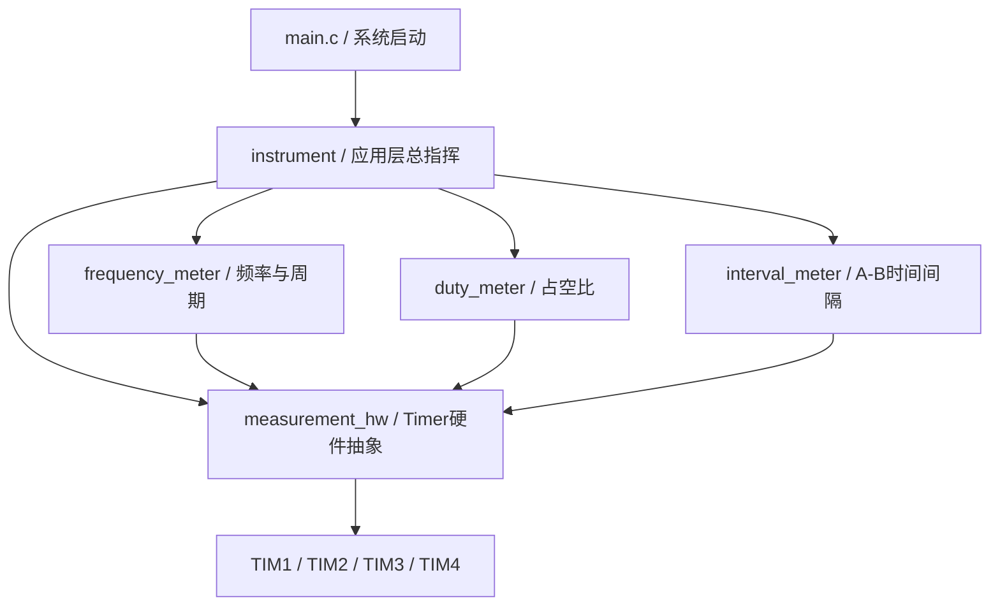
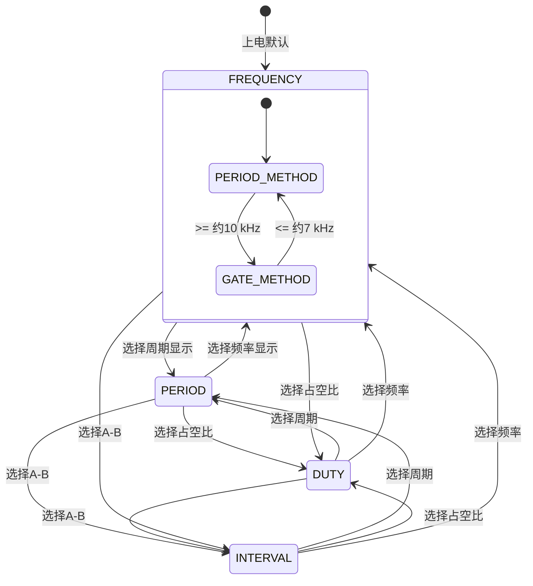
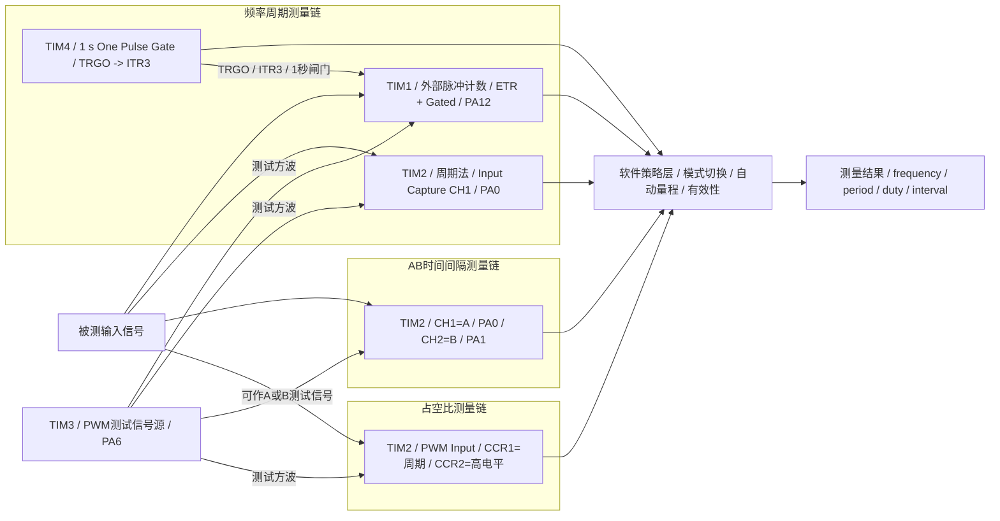

# embed-2015F-DigitalFrequencyMeter

基于 **STM32F103C8T6 + STM32CubeMX + HAL** 的数字频率计学习项目。

项目以 2015 年全国大学生电子设计竞赛 F 题《数字频率计》为背景，通过一个真实测量项目串起 STM32 Timer 的关键能力：**PWM、输入捕获、外部脉冲计数、PWM Input、One Pulse、Master/Slave、TRGO、Update Event、中断、溢出扩展、测量有效性、多定时器协同以及嵌入式软件模块化**。

当前核心测量代码已经覆盖：

- 频率测量
- 周期测量
- A→B 时间间隔测量
- 占空比测量
- 低频周期法 / 高频闸门法自动切换
- 测量超时与结果有效性
- GitHub Actions ARM 交叉编译验证

> 当前阶段的软件测量骨架已经基本成型，但 **真实精度、最高输入频率、模拟前端和完整竞赛指标仍需要实板验证**。

---

## 软件工程结构

测量逻辑已经从 `main.c` 拆出，CubeMX 生成代码与应用层逻辑分开：

```text
firmware/
├── Core/
│   ├── Inc/
│   └── Src/
│       └── main.c
│
├── App/
│   ├── Inc/
│   │   ├── instrument.h
│   │   ├── frequency_meter.h
│   │   ├── duty_meter.h
│   │   ├── interval_meter.h
│   │   └── measurement_hw.h
│   │
│   └── Src/
│       ├── instrument.c
│       ├── frequency_meter.c
│       ├── duty_meter.c
│       ├── interval_meter.c
│       └── measurement_hw.c
│
└── CMakeLists.txt
```

### 模块职责

| 模块 | 职责 |
| --- | --- |
| `main.c` | MCU / CubeMX 初始化，然后只调用 `Instrument_Init()` 和 `Instrument_Task()` |
| `instrument.c` | 仪器应用层总指挥：模式切换、Gate 结果分发、HAL Capture 回调路由 |
| `frequency_meter.c` | 周期法、闸门法、7~10 kHz 迟滞、频率/周期最终结果 |
| `duty_meter.c` | TIM2 PWM Input 占空比、自动 PSC、占空比有效性 |
| `interval_meter.c` | A→B 时间间隔、WAIT_A/WAIT_B、超时和重新同步 |
| `measurement_hw.c` | TIM1/TIM2/TIM3/TIM4 的底层启动、寄存器重配置、扩展时间戳、Gate 快照 |

### 软件模块调用关系



现在 `main.c` 的核心应用代码已经简化为：

```c
Instrument_Init();

while (1)
{
    Instrument_Task();
}
```

算法状态全部封装在各自 `.c` 文件内部，外部通过函数接口访问，不再直接共享大量全局变量。

---

## 当前仪器模式

软件目前划分为 4 种仪器功能模式：

```c
typedef enum
{
  INSTRUMENT_MODE_FREQUENCY = 0,
  INSTRUMENT_MODE_PERIOD,
  INSTRUMENT_MODE_DUTY,
  INSTRUMENT_MODE_INTERVAL
} InstrumentMode;
```

| 模式 | 功能 | 主要硬件路径 |
| --- | --- | --- |
| `FREQUENCY` | 测频率 | TIM2 周期法 + TIM1/TIM4 闸门法自动切换 |
| `PERIOD` | 测周期 | 共用频率测量引擎，再换算周期 |
| `DUTY` | 测占空比 | TIM2 PWM Input + TIM1/TIM4 粗频率辅助自动选择 PSC |
| `INTERVAL` | 测 A→B 时间间隔 | TIM2_CH1 + TIM2_CH2 双路输入捕获 |

模式切换统一通过：

```c
Instrument_SetMode(...)
```

以后接按键、串口菜单或 TFT/LVGL 时，上层只需要操作 `instrument`，不需要直接碰底层 Timer。

### 仪器模式状态切换图



这里有两层不同概念：

```text
仪器功能模式：FREQUENCY / PERIOD / DUTY / INTERVAL
频率内部策略：PERIOD_METHOD / GATE_METHOD
```

前者回答“用户想测什么”，后者回答“固件内部具体怎么测”。

---

## 定时器资源分配

| 定时器 | 当前职责 | 主要模式 | 关键引脚 | 作用 |
| --- | --- | --- | --- | --- |
| **TIM1** | 外部脉冲计数器 | ETR External Clock Mode 2 + Gated Slave Mode | PA12 / TIM1_ETR | 在 TIM4 打开的 1 秒 Gate 内统计外部脉冲 |
| **TIM2** | 高分辨率时间测量核心 | Input Capture / PWM Input | PA0 / CH1，PA1 / CH2 | 周期、A→B 时间间隔、占空比 |
| **TIM3** | 内部测试信号源 | PWM Generation CH1 | PA6 / TIM3_CH1 | 输出约 1 kHz、50% 占空比测试 PWM |
| **TIM4** | 1 秒硬件闸门 | One Pulse + TRGO Enable | 无外部输入 | 产生 1 秒 Gate，通过 ITR3 控制 TIM1 |

---

## 各个定时器调用关系 / 配合框图



---

## TIM3：PWM 测试信号源

TIM3_CH1 当前输出约 **1 kHz、50% 占空比**：

```text
Timer Clock = 72 MHz
PSC         = 71
ARR         = 999
CCR1        = 500
```

所以：

```text
72 MHz / (71 + 1) = 1 MHz
1 MHz / (999 + 1) = 1 kHz
Duty ≈ 500 / 1000 = 50%
```

TIM3 启动后完全由硬件持续输出 PWM。

---

## TIM2：72 MHz 高分辨率时间轴

普通周期 / 时间间隔模式：

```text
Timer Clock = 72 MHz
PSC         = 0
ARR         = 65535
1 tick      ≈ 13.89 ns
```

`measurement_hw.c` 使用 `tim2_overflow_count` 把 16 位 CNT 扩展为软件 64 位时间戳：

```text
extended_timestamp = overflow_count × 65536 + CCRx
```

同时处理 UIF 与 Capture 几乎同时发生的溢出边界。

### FREQUENCY / PERIOD

TIM2_CH1 捕获相邻两个上升沿：

```text
period_ticks = timestamp2 - timestamp1
frequency    = 72 MHz / period_ticks
```

低频时一个周期包含大量 tick，因此周期法分辨率很好。

### INTERVAL

```text
PA0 / CH1 = A
PA1 / CH2 = B
```

```text
A 到来 -> 记录 start
B 到来 -> interval = B - A
```

A 到来后超过 200 ms 没有 B，则丢弃本次 A 并重新同步。

### DUTY / PWM Input

DUTY 模式仍然只需要 PA0/TI1：

```text
CH1 Direct TI1   -> 上升沿 -> CCR1 = 周期
CH2 Indirect TI1 -> 下降沿 -> CCR2 = 高电平时间
```

```text
Duty = CCR2 / CCR1 × 100%
```

CC1/CC2 不产生每边沿 ISR，由硬件持续锁存、主循环轮询读取。

TIM1+TIM4 的粗频率还会辅助自动选择 TIM2 PSC，使单周期尽量不超过约 60000 tick。

---

## TIM1 + TIM4：1 秒硬件闸门测频

TIM4：

```text
PSC       = 7199
ARR       = 9999
One Pulse = Single
TRGO      = Enable
```

形成 1 秒 TRGO 高电平 Gate。

TIM1：

```text
Clock Source = ETR Mode 2
Input        = PA12 / TIM1_ETR
Slave Mode   = Gated
Trigger      = ITR3
PSC          = 0
ARR          = 65535
```

只有 TIM4 Gate 为高时，TIM1 才统计 PA12 外部脉冲。

1 秒窗口结束后：

```text
gate_frequency_hz ≈ 1 秒内脉冲总数
```

频率测量采用迟滞：

```text
周期法 -> 闸门法：约 >= 10 kHz
闸门法 -> 周期法：约 <= 7 kHz
```

这样避免临界点反复切换。

---

## HAL Callback 的工程化分工

工程只保留一份 HAL Callback 定义，不让各业务模块重复定义同名回调：

```text
HAL_TIM_IC_CaptureCallback
        ↓
instrument.c
        ↓
按当前模式分发
├─ frequency_meter
└─ interval_meter
```

```text
HAL_TIM_PeriodElapsedCallback
        ↓
measurement_hw.c
        ↓
只维护硬件状态
├─ TIM1 overflow
├─ TIM2 overflow
└─ TIM4 gate_ready
```

DUTY 的高频 PWM Input 不走 Capture ISR，而是在 `DutyMeter_Task()` 中读取 CCR。

---

## 有效性与超时

各模块内部自己管理结果和状态：

| 功能 | 核心结果 | 有效性 |
| --- | --- | --- |
| 频率 / 周期 | `measured_frequency_hz` / `measured_period_ns` | `FrequencyMeter_IsValid()` |
| 占空比 | `measured_duty_permille` | `DutyMeter_IsValid()` |
| 时间间隔 | `interval_ns` | `IntervalMeter_IsValid()` |

应用层统一通过 `Instrument_Get...()` / `Instrument_IsResultValid()` 读取，不直接访问模块内部 `static` 状态。

这与 Java 中的 `private` 状态 + getter / service 接口是同一种封装思想。

---

## GitHub Actions ARM 编译

仓库已配置 STM32 固件 CI：

- ARM GCC 交叉编译
- 链接
- `arm-none-eabi-size`
- 生成 `.elf / .hex / .bin / .map`
- 上传 Artifact

模块化重构后的 ARM Debug Build 已成功通过。

当前资源占用：

```text
RAM   : 2 KB / 20 KB ≈ 10.00%
FLASH : 17732 B / 64 KB ≈ 27.06%
```

---

## 当前完成度

### 已实现

- TIM3 1 kHz / 50% PWM 测试源
- TIM2 72 MHz 周期法
- TIM2 16 位扩展时间轴
- TIM1 + TIM4 1 秒硬件 Gate
- 周期法 / 闸门法自动切换与迟滞
- 高频捕获中断保护
- 频率 / 周期测量
- A→B 时间间隔、超时、重新同步
- TIM2 PWM Input 占空比
- DUTY 动态 PSC
- FREQUENCY / PERIOD / DUTY / INTERVAL 仪器模式
- App / Hardware 分层模块化
- GitHub Actions ARM 真编译

### 仍需实测 / 完成

- 开发板实测和误差测试
- 1 Hz ~ 10 MHz 全范围验证
- 7~10 kHz 切换边界验证
- A→B 0.1 us ~ 100 ms 验证
- 占空比 1 Hz ~ 5 MHz、10%~90% 验证
- 高频端时间量化误差评估
- OLED / TFT / LVGL
- 按键 / 菜单交互
- 自动单位显示
- 正弦输入放大、比较、施密特整形与保护前端
- 完整 2015 F 性能指标验证

---

## 推荐硬件自测接线

### 频率 / 周期 / 占空比

```text
PA6 (TIM3 PWM)
 ├─> PA0  (TIM2_CH1 / PWM Input)
 └─> PA12 (TIM1_ETR)
```

预期测试源：

```text
Frequency ≈ 1000 Hz
Period    ≈ 1 ms
Duty      ≈ 50.0%
```

### A→B 时间间隔

```text
信号 A -> PA0 / TIM2_CH1
信号 B -> PA1 / TIM2_CH2
```

---

## 项目定位

> **围绕 2015 F 数字频率计展开的 STM32 定时器综合测量原型，同时作为嵌入式软件工程分层实践。**

当前项目已经把下面这些内容串在同一个工程里：

```text
PWM
Input Capture
PWM Input
External Clock
One Pulse
Master / Slave
TRGO / ITR
Gated Mode
NVIC / ISR
16 位溢出扩展
超时与有效性
自动测量策略
模块封装与事件分发
GitHub Actions ARM CI
```

下一阶段重点从“继续往 main.c 堆代码”转向：**实板验证、显示交互、模拟输入前端和完整性能测试**。
