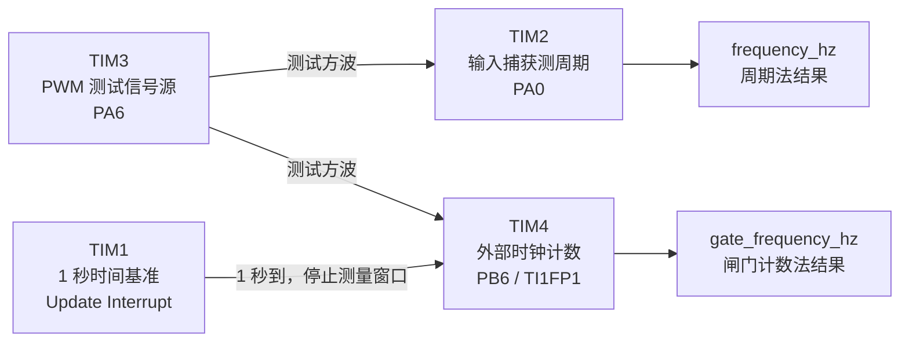

# embed-2015F-DigitalFrequencyMeter

基于 **STM32F103C8T6 + STM32CubeMX + HAL** 的数字频率计学习项目。

项目以 2015 年全国大学生电子设计竞赛 F 题《数字频率计》为背景，当前重点不是一次性完成全部竞赛指标，而是通过真实项目把 STM32 Timer 的核心知识串起来：**PWM、输入捕获、外部时钟计数、Update Event、中断、溢出扩展计数以及多个定时器协同工作**。

## 当前实现思路

目前同时保留两种频率测量方法：

1. **测周期法**：TIM2 输入捕获相邻两个上升沿，计算周期，再换算频率。
2. **闸门计数法**：TIM4 在 TIM1 提供的 1 秒时间窗内统计输入脉冲数。

TIM3 作为项目内部的 PWM 测试信号源。

## 定时器资源分配

| 定时器 | 当前职责 | 工作模式 | 关键引脚 | 主要作用 |
| --- | --- | --- | --- | --- |
| **TIM1** | 1 秒测量闸门 | Base Timer + Update Interrupt | 无 | 每 1 秒产生一次 Update Event，结束一轮 TIM4 测频窗口 |
| **TIM2** | 周期法测频 | Input Capture CH1 + Update Interrupt | PA0 / TIM2_CH1 | 捕获输入上升沿，测量相邻边沿间隔 |
| **TIM3** | 测试信号源 | PWM Generation CH1 | PA6 / TIM3_CH1 | 输出约 1 kHz、50% 占空比 PWM |
| **TIM4** | 闸门计数法测频 | External Clock Mode 1 + Update Interrupt | PB6 / TIM4_CH1 / TI1 | 每个输入上升沿推动 CNT +1，并统计 16 位计数器溢出次数 |

## 四个定时器如何配合



测试时可以把 TIM3 的 PA6 PWM 输出分别接到 PA0 和 PB6，用同一个已知信号验证两种测频方法。

整体逻辑也可以简化为：

```text
                    ┌─────────────────────┐
                    │        TIM3         │
                    │   PWM 测试信号源     │
                    │      PA6 输出        │
                    └─────────┬───────────┘
                              │
                 ┌────────────┴────────────┐
                 │                         │
                 ▼                         ▼
        ┌────────────────┐        ┌────────────────┐
        │      TIM2      │        │      TIM4      │
        │ 输入捕获测周期   │        │ 外部时钟数脉冲   │
        │   PA0 / CH1    │        │ PB6 / TI1FP1  │
        └───────┬────────┘        └───────┬────────┘
                │                         │
                ▼                         │
        frequency_hz                     │
                                          │
                                  ┌───────┴────────┐
                                  │      TIM1      │
                                  │ 1 秒闸门定时器  │
                                  │ Update 中断     │
                                  └───────┬────────┘
                                          │
                                          ▼
                                 gate_frequency_hz
```

## TIM3：PWM 测试信号源

TIM3_CH1 当前用于产生固定测试方波。

典型配置：

```text
Timer Clock = 72 MHz
PSC         = 71
ARR         = 999
CCR1        = 500
```

计算：

```text
72 MHz / (71 + 1) = 1 MHz
1 MHz / (999 + 1) = 1 kHz
```

CCR1 约等于周期计数的一半，因此当前 PWM 占空比约为 50%。

TIM3 启动后由硬件持续产生 PWM，不需要 CPU 在主循环里不断翻转 GPIO。

## TIM2：输入捕获测周期

TIM2_CH1 使用 PA0 作为输入捕获引脚。

当前 TIM2：

```text
PSC = 71
ARR = 65535
```

所以：

```text
72 MHz / (71 + 1) = 1 MHz
1 tick = 1 us
```

当 PA0 出现上升沿时，TIM2 硬件自动把当时的 CNT 保存到 CCR1，然后触发输入捕获中断。

流程：

```text
PA0 上升沿
    ↓
TIM2_CH1 Input Capture
    ↓
CCR1 = 当前 CNT 快照
    ↓
HAL_TIM_IC_CaptureCallback()
    ↓
构造扩展时间戳
    ↓
timestamp2 - timestamp1
    ↓
period_ticks
    ↓
frequency_hz = 1 / T
```

因为 TIM2 是 16 位定时器，CNT 只能表示 0~65535，所以项目使用 `tim2_overflow_count` 记录溢出次数，并把硬件 CNT 扩展成更长的软件时间轴。

当前扩展时间戳思想：

```text
extended_timestamp = overflow_count × 65536 + CCR1
```

同时对 UIF 与捕获边界做了额外处理，避免“硬件已经溢出，但软件溢出计数还没来得及更新”造成时间戳错误。

## TIM4：External Clock Mode 1 外部计数

TIM4 不再使用内部 Timer Clock 推动 CNT，而是选择：

```text
Slave Mode     = External Clock Mode 1
Trigger Source = TI1FP1
PSC            = 0
ARR            = 65535
```

输入路径：

```text
PB6
 ↓
TIM4_CH1 / TI1
 ↓
TI1FP1
 ↓
Slave Mode Controller
 ↓
External Clock Mode 1
 ↓
TIM4_CNT + 1
```

因此 PB6 每出现一个有效上升沿，TIM4 的 CNT 就由硬件自动加 1，CPU 不需要为每个输入脉冲进入一次中断。

### TIM4 的 16 位溢出扩展

TIM4 同样只有 16 位：

```text
0 → 1 → ... → 65535 → 0 → ...
```

因此使用 `tim4_overflow_count` 统计 Update Event：

```text
总脉冲数 = tim4_overflow_count × 65536 + TIM4_CNT
```

例如 1 秒输入 100000 个脉冲：

```text
100000 = 1 × 65536 + 34464
```

所以最终读到 CNT=34464 时，再结合一次溢出即可恢复真实总脉冲数 100000。

## TIM1：1 秒测量时间基准

TIM1 使用内部时钟作为 Base Timer。

当前配置：

```text
Timer Clock = 72 MHz
PSC         = 7199
ARR         = 9999
```

计算：

```text
72 MHz / (7199 + 1) = 10 kHz
1 tick = 0.1 ms
10000 tick = 1 s
```

所以 TIM1 每 1 秒产生一次 Update Event，并通过 `TIM1_UP_IRQn` 进入 HAL 的 Period Elapsed Callback。

当前回调中：

```text
TIM1 1 秒到
    ↓
暂停 TIM1
暂停 TIM4
    ↓
gate_ready = 1
    ↓
主循环读取 TIM4 快照
    ↓
计算 gate_frequency_hz
    ↓
清零并开始下一轮
```

这里的 TIM1 负责“计时间”，TIM4 负责“数脉冲”。

## 两种测频方法对比

### 周期法：TIM2

测量的是：

```text
一个周期用了多少时间 tick
```

公式：

```text
f = 1 / T
```

更适合低频或中低频信号，因为低频周期长，可以得到很多时间 tick，分辨率较高。

### 闸门计数法：TIM1 + TIM4

测量的是：

```text
固定时间窗口内来了多少个脉冲
```

当前窗口为 1 秒，所以：

```text
frequency_hz ≈ 1 秒内统计到的脉冲数
```

更适合较高频率信号。

## 当前关键自定义变量

| 变量 | 作用 |
| --- | --- |
| `timestamp1` | TIM2 上一次输入捕获对应的扩展时间戳 |
| `timestamp2` | TIM2 当前输入捕获对应的扩展时间戳 |
| `period_ticks` | 两次 TIM2 捕获之间的 tick 差值 |
| `frequency_hz` | TIM2 周期法得到的频率结果 |
| `capture_state` | 标记 TIM2 是否已经获得第一笔有效捕获 |
| `tim2_overflow_count` | TIM2 CNT 的软件溢出计数 |
| `tim4_overflow_count` | TIM4 CNT 的软件溢出计数 |
| `gate_frequency_hz` | TIM1 + TIM4 闸门计数法得到的频率结果 |
| `gate_ready` | TIM1 的 1 秒窗口结束标志 |

TIM3 当前没有额外的软件状态变量，因为它只负责固定参数 PWM：初始化一次、启动一次，之后由硬件独立持续输出。

## 当前完成度

### 已实现

- TIM3 PWM 测试信号源
- TIM2 输入捕获测周期
- TIM2 16 位溢出扩展时间戳
- TIM2 捕获/溢出边界处理
- TIM4 External Clock Mode 1 外部脉冲计数
- TIM4 16 位溢出扩展计数
- TIM1 1 秒 Base Timer
- TIM1 Update Interrupt 控制测量窗口
- 周期法与闸门计数法两套测频思路

### 尚未完成

- 实板验证与误差测试
- 更严格的硬件同步闸门（例如 Master/Slave、TRGO）
- 双路时间间隔测量
- 占空比测量
- OLED/LCD 显示
- Hz / kHz / MHz、us / ms / s 自动单位切换
- 正弦波输入的模拟放大、比较和整形前端
- 2015 F 题完整性能指标

## 当前项目定位

当前仓库更准确的定位是：

> **围绕 2015 F 数字频率计展开的 STM32 定时器学习与测量原型。**

项目通过同一个测试信号，把 PWM、输入捕获、外部计数、Update Event、中断、NVIC、溢出处理以及多 Timer 协同放到一个完整工程中理解和验证。

后续在当前软件控制闸门的基础上，可以继续学习 TIM 的 Master/Slave 与 TRGO，让 TIM1 和 TIM4 进一步实现纯硬件同步。
