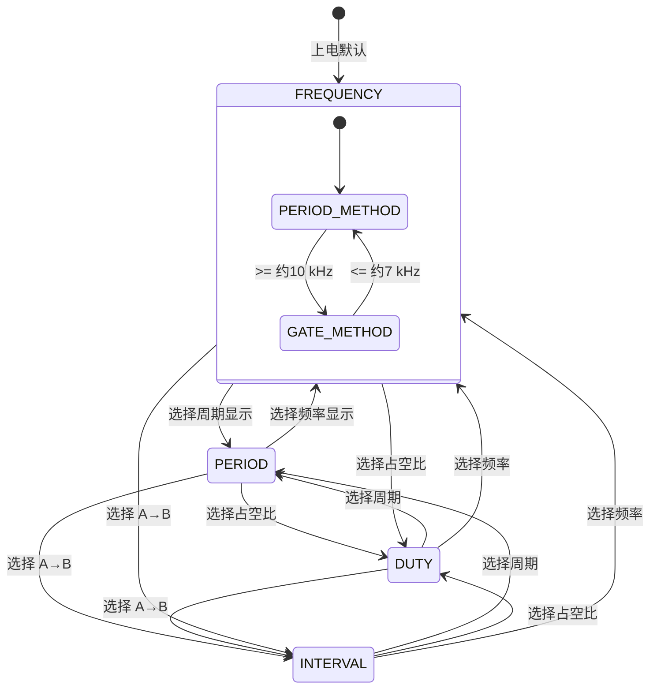

# embed-2015F-DigitalFrequencyMeter

基于 **STM32F103C8T6 + STM32CubeMX + HAL** 的数字频率计学习项目。

项目以 2015 年全国大学生电子设计竞赛 F 题《数字频率计》为背景，目标不是先把所有竞赛指标一次性堆完，而是通过一个真实测量项目把 STM32 Timer 的关键能力串起来：**PWM、输入捕获、外部脉冲计数、PWM Input、One Pulse、Master/Slave、TRGO、Update Event、中断、溢出扩展、测量有效性与多定时器协同**。

当前核心测量代码已经覆盖：

- 频率测量
- 周期测量
- A→B 时间间隔测量
- 占空比测量
- 低频周期法 / 高频闸门法自动切换
- 测量超时与结果有效性
- GitHub Actions ARM 交叉编译验证

> 当前阶段的软件测量骨架已经基本成型，但 **真实精度、最高输入频率、模拟前端和完整竞赛指标仍需要实板验证**。

---

## 当前仪器模式

软件目前划分为 4 种仪器功能模式：

```c
typedef enum
{
  INSTRUMENT_MODE_FREQUENCY = 0,
  INSTRUMENT_MODE_PERIOD,
  INSTRUMENT_MODE_DUTY,
  INSTRUMENT_MODE_INTERVAL
} InstrumentMode;
```

对应：

| 模式 | 功能 | 主要硬件路径 |
| --- | --- | --- |
| `FREQUENCY` | 测频率 | TIM2 周期法 + TIM1/TIM4 闸门法自动切换 |
| `PERIOD` | 测周期 | 共用频率测量引擎，再换算周期 |
| `DUTY` | 测占空比 | TIM2 PWM Input + TIM1/TIM4 粗频率辅助自动选择 PSC |
| `INTERVAL` | 测 A→B 时间间隔 | TIM2_CH1 + TIM2_CH2 双路输入捕获 |

模式切换统一通过：

```c
Instrument_SetMode(...)
```

后续接按键、串口菜单或 TFT/LVGL 时，不需要让显示层直接操作底层 Timer。

### 仪器模式状态切换图

四种仪器模式属于“用户功能层”；其中 `FREQUENCY / PERIOD` 共享自动频率测量引擎，而 `DUTY` 和 `INTERVAL` 会重新配置 TIM2 的工作方式。



对应底层资源变化：

```text
FREQUENCY / PERIOD
├─ TIM2_CH1：周期法入口
├─ TIM1：外部脉冲计数
├─ TIM4：1 s 硬件 Gate
└─ 内部自动选择 PERIOD_METHOD / GATE_METHOD

DUTY
├─ TIM2：切成 PWM Input
│  ├─ CCR1 = 周期
│  └─ CCR2 = 高电平时间
└─ TIM1 + TIM4：提供粗频率，辅助自动调整 TIM2 PSC

INTERVAL
├─ TIM2_CH1 = A
├─ TIM2_CH2 = B
└─ TIM1 + TIM4：停止，避免无意义计数
```

这里要注意两层概念：

```text
仪器功能模式：FREQUENCY / PERIOD / DUTY / INTERVAL

频率测量内部策略：PERIOD_METHOD / GATE_METHOD
```

前者是以后用户通过按键或菜单选择的功能；后者是固件内部自动决定“怎么测”。

---

## 定时器资源分配

| 定时器 | 当前职责 | 主要模式 | 关键引脚 | 作用 |
| --- | --- | --- | --- | --- |
| **TIM1** | 外部脉冲计数器 | ETR External Clock Mode 2 + Gated Slave Mode | PA12 / TIM1_ETR | 在 TIM4 打开的 1 秒 Gate 内统计外部脉冲 |
| **TIM2** | 高分辨率时间测量核心 | Input Capture / PWM Input | PA0 / CH1，PA1 / CH2 | 周期、A→B 时间间隔、占空比 |
| **TIM3** | 内部测试信号源 | PWM Generation CH1 | PA6 / TIM3_CH1 | 输出约 1 kHz、50% 占空比测试 PWM |
| **TIM4** | 1 秒硬件闸门 | One Pulse + TRGO Enable | 无外部输入 | 产生 1 秒 Gate，通过 ITR3 控制 TIM1 |

---

## 各个定时器调用关系 / 配合框图

### 1）整体协同框图

```mermaid
flowchart LR
    SIG[被测输入信号]
    T3[TIM3\nPWM测试信号源\nPA6]

    subgraph FREQ[频率 / 周期测量链]
      T2A[TIM2\n周期法\nInput Capture CH1\nPA0]
      T1[TIM1\n外部脉冲计数\nETR + Gated\nPA12]
      T4[TIM4\n1 s One Pulse Gate\nTRGO -> ITR3]
    end

    subgraph DUTY[占空比测量链]
      T2D[TIM2\nPWM Input\nCCR1 = 周期\nCCR2 = 高电平]
    end

    subgraph INTERVAL[A→B 时间间隔测量链]
      T2I[TIM2\nCH1 = A(PA0)\nCH2 = B(PA1)]
    end

    STRAT[软件策略层\n模式切换 / 自动量程 / 有效性]
    OUT[测量结果\nfrequency / period / duty / interval]

    T3 -->|测试方波| T2A
    T3 -->|测试方波| T1
    T3 -->|测试方波| T2D
    T3 -->|可作 A 或 B 测试信号| T2I

    SIG --> T2A
    SIG --> T1
    SIG --> T2D
    SIG --> T2I

    T4 -->|TRGO / ITR3 打开 1 秒闸门| T1

    T2A --> STRAT
    T1 --> STRAT
    T4 --> STRAT
    T2D --> STRAT
    T2I --> STRAT

    STRAT --> OUT
```

### 2）Timer 之间的直接关系

```text
TIM3
 └─ 内部测试信号源（PA6 输出 PWM）
    ├─ 可接到 PA0，供 TIM2 做周期法 / DUTY 测试
    └─ 可接到 PA12，供 TIM1 做闸门计数测试

TIM4
 └─ 1 秒 One Pulse 硬件闸门
    └─ TRGO 通过 ITR3 控制 TIM1 的 Gated Mode

TIM1
 └─ 在 TIM4 打开的 1 秒时间窗内统计外部脉冲数

TIM2
 ├─ FREQUENCY / PERIOD：CH1 输入捕获，做高分辨率周期法
 ├─ DUTY：PWM Input，同一根 PA0 同时锁存周期和高电平时间
 └─ INTERVAL：CH1=A、CH2=B，测 A→B 时间间隔
```

### 3）当前核心关系（简图）

```text
                 被测数字信号
                /           \
               /             \
        PA0 / TIM2          PA12 / TIM1_ETR
            │                     │
   周期 / PWM Input          外部脉冲计数
            │                     │
            │                 TIM1 Gated
            │                     ▲
            │                     │ ITR3
            │                 TIM4 TRGO
            │                 1 s One Pulse
            │
            └────── 软件策略层 ──────┘
```

测试时可以使用 TIM3 的 PA6 作为已知信号源，再把同一信号分配到对应测量输入。

---

## TIM3：PWM 测试信号源

TIM3_CH1 当前用于输出约 **1 kHz、50% 占空比** 的测试信号。

```text
Timer Clock = 72 MHz
PSC         = 71
ARR         = 999
CCR1        = 500
```

因此：

```text
72 MHz / (71 + 1) = 1 MHz
1 MHz / (999 + 1) = 1 kHz
Duty ≈ 500 / 1000 = 50%
```

TIM3 启动后完全由硬件持续产生 PWM，不需要 CPU 在主循环里翻转 GPIO。

---

## TIM2：72 MHz 高分辨率时间轴

普通周期 / 时间间隔模式下 TIM2 使用：

```text
Timer Clock = 72 MHz
PSC         = 0
ARR         = 65535
```

因此：

```text
1 tick = 1 / 72 MHz ≈ 13.89 ns
```

### 1）FREQUENCY / PERIOD 模式

TIM2_CH1 采集相邻两个上升沿，构造 64 位扩展时间戳：

```text
extended_timestamp = overflow_count × 65536 + CCR1
```

然后：

```text
period_ticks = timestamp2 - timestamp1
period_ns    = period_ticks × 1e9 / 72e6
frequency    = 72e6 / period_ticks
```

为了保证“拔掉信号后不会长期保留旧结果”，软件实现了：

- `frequency_valid`
- `last_capture_tick_ms`
- `FREQUENCY_TIMEOUT_MS = 1500 ms`

即：超过 1.5 秒没有新的上升沿，周期法结果自动失效并清零。

### 2）INTERVAL 模式

TIM2_CH1 作为 **A**，TIM2_CH2 作为 **B**：

```text
A 到来
 ↓
记录 start timestamp
 ↓
等待 B
 ↓
B 到来
 ↓
interval = B - A
```

同时实现：

- `interval_valid`
- `interval_waiting_ch2`
- `INTERVAL_TIMEOUT_MS = 200 ms`

若 A 到来后 200 ms 内一直没有 B，则放弃本次 A，清空旧结果并重新同步。

### 3）DUTY 模式：PWM Input

DUTY 模式下，TIM2 运行时动态改成 **PWM Input**：

- `CCR1`：一个完整周期的计数值
- `CCR2`：高电平时间计数值

关系：

```text
Duty = CCR2 / CCR1 × 100%
```

这里不再让每个上升沿 / 下降沿都进入中断，而是由硬件持续锁存 `CCR1 / CCR2`，主循环轮询读取，因此高频 PWM 时不会制造海量 ISR。

为了兼顾低频与高频，DUTY 模式会结合 `TIM1 + TIM4` 得到的粗频率自动调整 TIM2 的 PSC，使单周期尽量控制在约 `60000 tick` 左右，兼顾：

- 低频不溢出
- 高频保持尽量高的分辨率

当前占空比结果以：

```text
measured_duty_permille
```

表示，即：

- `500` → `50.0%`
- `333` → `33.3%`
- `725` → `72.5%`

---

## TIM1 + TIM4：1 秒硬件闸门测频

### TIM4：1 秒 Gate 发生器

TIM4 当前用于 **One Pulse 硬件闸门**，通过 `TRGO Enable` 输出一段固定长度的高电平窗口。

作用可以理解为：

```text
启动 TIM4
 ↓
TRGO 拉高
 ↓
保持 1 秒
 ↓
TRGO 拉低
 ↓
TIM4 自动停止
```

### TIM1：被 TIM4 Gate 控制的外部脉冲计数器

TIM1 使用：

- `ETR External Clock Mode 2`
- `Gated Slave Mode`

输入脉冲从 `PA12 / TIM1_ETR` 进入；只有在 TIM4 通过 `ITR3` 打开 Gate 的 1 秒窗口内，TIM1 才允许统计外部脉冲。

最终：

```text
gate_frequency_hz = 1 秒内统计到的脉冲总数
```

并配合 `tim1_overflow_count` 实现 16 位计数器的软件扩展。

### 为什么周期法和闸门法要共存

- **低频**：周期长，TIM2 周期法分辨率高
- **高频**：单周期 tick 太少，闸门法更合适

因此项目实现了：

```text
低频 → TIM2 周期法
高频 → TIM1 + TIM4 闸门法
```

并加了 **7 kHz ~ 10 kHz 迟滞区**，避免在临界点来回抖动。

另外，当周期法判断频率已经进入高频区时，会立即关闭 `TIM2 CH1` 输入捕获中断，避免高频输入把 MCU 拖入“捕获中断风暴”。

---

## 自动测量策略

FREQUENCY / PERIOD 模式内部使用的不是“固定一种算法”，而是自动策略：

```text
                输入信号
                   │
      ┌────────────┴────────────┐
      ↓                         ↓
低频 / 中低频               高频
TIM2 周期法               TIM1 + TIM4 闸门法
      │                         │
      └────────────┬────────────┘
                   ↓
              软件策略层
                   ↓
     measured_frequency_hz / measured_period_ns
```

切换条件：

- `period_ticks <= 7200` → 转闸门法（约 10 kHz）
- `gate_frequency_hz <= 7000` → 转回周期法（约 7 kHz）

这样形成 7~10 kHz 的迟滞区。

---

## 有效性与超时设计

当前项目已经把“测量值”和“测量状态”明确区分开：

| 功能 | 结果变量 | 有效性变量 | 超时行为 |
| --- | --- | --- | --- |
| 频率 / 周期 | `measured_frequency_hz` / `measured_period_ns` | `frequency_valid`、`gate_frequency_valid` | 无输入时自动失效 |
| 占空比 | `measured_duty_permille` | `duty_valid` | 长时间无新 PWM 锁存则失效 |
| 时间间隔 | `interval_ns` | `interval_valid` | A 等 B 超时则丢弃本次 A |

这一步很重要，因为真正的仪器软件不能只保存“上次测出来多少”，还必须知道：

> **这个值现在还能不能信。**

---

## GitHub Actions ARM 编译

仓库已经加入最小可用的 STM32 固件 CI：

- ARM 交叉编译
- 链接
- `arm-none-eabi-size`
- 生成 `.elf / .hex / .bin / .map`
- 上传构建产物 Artifact

当前 C8T6 资源占用（加入 DUTY 后的一次成功编译）：

```text
RAM   : 2032 B / 20 KB  ≈ 9.92%
FLASH : 18164 B / 64 KB ≈ 27.72%
```

因此现在不只是“代码看起来像能编译”，而是每次提交都会经过真实的 `arm-none-eabi-gcc` 校验。

---

## 当前完成度

### 已完成（软件骨架）

- TIM3 PWM 测试信号源
- TIM2 72 MHz 周期法测频
- TIM2 16 位溢出扩展时间戳
- TIM1 + TIM4 1 秒硬件闸门测频
- 周期法 / 闸门法自动切换
- 高频时关闭 TIM2 CH1 捕获中断，避免 ISR 爆炸
- 周期测量
- A→B 时间间隔测量
- `interval_valid` + 超时 + 重新同步
- TIM2 PWM Input 占空比测量
- DUTY 自动调整 PSC
- FREQUENCY / PERIOD / DUTY / INTERVAL 仪器模式骨架
- GitHub Actions ARM 交叉编译验证

### 仍需完成 / 仍需实测

- 实板验证与误差测试
- 各频段切换边界的真实表现
- DUTY 在高频端的实际分辨率验证
- OLED / TFT / LVGL 显示层
- 按键 / 菜单 / 串口切换模式
- 统一测量结果输出层
- Hz / kHz / MHz、ns / us / ms 自动单位
- 正弦波输入的模拟放大、比较和整形前端
- 2015 F 题完整性能指标验证
- 更高频率与更高灵敏度的发挥部分

---

## 推荐测试接线

### 1）频率 / 周期测试

可以先用 TIM3 作为自测信号源：

```text
PA6 (TIM3 PWM)
 ├─> PA0  (TIM2_CH1)
 └─> PA12 (TIM1_ETR)
```

这样可以同时验证：

- 周期法结果
- 闸门法结果
- 自动切换逻辑

### 2）占空比测试

```text
PA6 (TIM3 PWM)
 ├─> PA0  (TIM2_CH1 / PWM Input)
 └─> PA12 (TIM1_ETR，可用于粗频率辅助调 PSC)
```

预期：

```text
frequency ≈ 1000 Hz
duty      ≈ 50.0%
```

### 3）A→B 时间间隔测试

```text
信号 A ──> PA0 (TIM2_CH1)
信号 B ──> PA1 (TIM2_CH2)
```

如果暂时没有双路信号源，也可以后续再用 PWM + 人工构造延时或双通道函数信号源验证。

---

## 项目定位

当前仓库更准确的定位是：

> **围绕 2015 F 数字频率计展开的 STM32 定时器学习工程 + 测量原型。**

它最大的价值不只是“最后测到一个数”，而是借这个项目真正把下面这些内容串起来：

- 一个定时器内部怎么工作
- 多个定时器之间如何协同
- 测量方法为什么要按频段切换
- 为什么结果必须区分 value / valid / timeout
- 为什么实际仪器设计不能只停留在“会配外设”

---

## 后续方向

后续比较自然的推进顺序：

1. 实板验证现有 4 种测量模式
2. 做结果统一输出层
3. 接 OLED / TFT 显示
4. 接按键 / 菜单切换仪器模式
5. 做自动单位显示
6. 加模拟前端（放大 / 比较 / 整形）
7. 对照 2015 F 题逐项做精度与性能验证

如果后续继续往“完整电赛题作品”推进，那么真正决定上限的就不再只是 HAL 代码，而会逐步转向：

- 输入整形前端
- 基准时钟精度
- 高频路径设计
- 抗抖 / 抗干扰
- 显示与交互完整度
- 系统级工程实现
